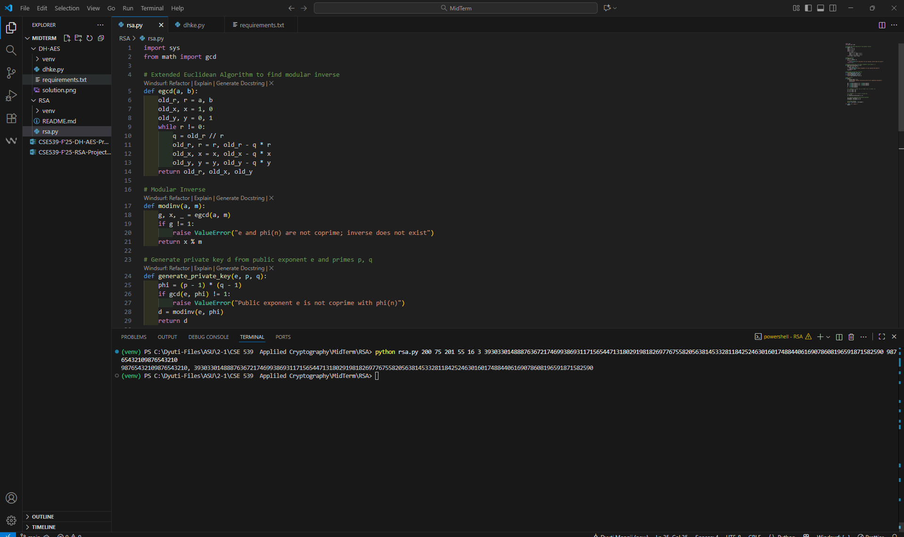
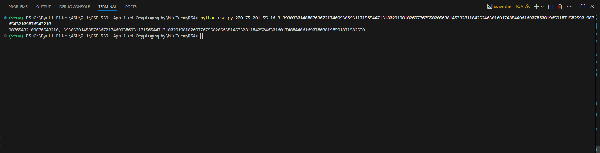

# 🧮 RSA Encryption and Decryption — CSE 539 Applied Cryptography

## 📘 Overview
This project implements the **RSA public-key cryptosystem** from scratch using Python 3.

It performs:
1. Generation of RSA keys from parameters provided via command-line arguments.
2. **Encryption** of a plaintext integer using the public key.
3. **Decryption** of a ciphertext integer using the private key.

This implementation also demonstrates number-theoretic operations like the **Extended Euclidean Algorithm** and **modular inverse**.

---

## 📁 File Contents
| File | Description |
|------|--------------|
| `rsa.py` | Main Python script implementing RSA key generation, encryption, and decryption. |
| `README.md` | This documentation file. |

---

## ⚙️ Requirements

### Python Version
- Python 3.8 or later

### Dependencies
This program uses only Python’s **standard library** — no external installations are needed.  
However, to keep your environment isolated, you can use a virtual environment.

```bash
python -m venv venv
venv\Scripts\activate       # on Windows
# or
source venv/bin/activate    # on macOS/Linux
```

## 🚀 How to Run the Program
The script takes 8 command-line arguments:
```bash
python rsa.py pe pc qe qc ee ec ciphertext plaintext
```
Where:
| Argument     | Description                                     |
| ------------ | ----------------------------------------------- |
| `pe`         | Exponent for prime `p` (used as 2^pe − pc)      |
| `pc`         | Constant subtracted from 2^pe                   |
| `qe`         | Exponent for prime `q` (used as 2^qe − qc)      |
| `qc`         | Constant subtracted from 2^qe                   |
| `ee`         | Exponent for public key `e` (used as 2^ee − ec) |
| `ec`         | Constant subtracted from 2^ee                   |
| `ciphertext` | Ciphertext integer to decrypt                   |
| `plaintext`  | Plaintext integer to encrypt                    |

## 🧩 Algorithmic Steps
### 1. Prime Reconstruction
- Compute:
 ```bash
  p = (2 ** pe) - pc
  q = (2 ** qe) - qc
  e = (2 ** ee) - ec
```

### 2. Modulus and Private Key Generation
- Compute:
```bash
  n = p * q
  φ(n) = (p - 1) * (q - 1)
  d = e⁻¹ mod φ(n)
```
where d is the modular inverse of e modulo φ(n).

### 3. Encryption and Decryption
- Encryption: C = P^e mod n
- Decryption: P = C^d mod n
  
### 4. Output
- Prints the decrypted integer and encrypted integer separated by a comma:
```bash
  decrypted_value, encrypted_value
```

## 🧠 Example Test Case
Example Command
```bash
python3 rsa.py 200 75 201 55 16 3 3930330148887636721746993869311715654471318029198182697767558205638145332811842524630160174884406169078608196591871582590 98765432109876543210
```
### Step-by-Step Explanation
#### 1. Compute:
```bash
  p = (2^200) − 75
    = 1606938044258990275541962092341162602522202993782792835301610911866622075
  q = (2^201) − 55
    = 3213876088517980551083924184682325205044405987565585670603221823733244057
  e = (2^16) − 3 = 65533
```
#### 2. Compute:
```bash
  n = p × q
  = 5164522597682292344938985110079877499648996447521548372652644233321860869693297053365834661769114680223172871953240758279272888275
  φ(n) = (p − 1) × (q − 1)
     = 5164522597682292344938985110079877499648996447521548372652644233321860869693297053365834661769114680223172871953240758279272888275
       − p − q + 1
     ≈ 5164522597682292344938985110079877499648996447521548372652644233321860869693297053365834661769114680223172871953240758276059029653
  d = e⁻¹ mod φ(n)
  = 1612217996476849155124381276015660192893998331623408977013977658420350671524743640668477920161914243571493565475549429992123799741
```
#### 3. Decrypt C:
```bash
  decrypted = C^d mod n
           = 98765432109876543210
```
#### 4. Encrypt P:
```bash
  encrypted = P^e mod n
           = 3930330148887636721746993869311715654471318029198182697767558205638145332811842524630160174884406169078608196591871582590
```
### ✅ Expected Output
```bash
  98765432109876543210, 3930330148887636721746993869311715654471318029198182697767558205638145332811842524630160174884406169078608196591871582590
```

## 🧾 Program Output Format
When you run the program, it prints:
```bash
<decrypted_plaintext>, <encrypted_ciphertext>
```
For example:
```bash
98765432109876543210, 3930330148887636721746993869311715654471318029198182697767558205638145332811842524630160174884406169078608196591871582590
```

## ⚠️ Error Handling
- If e and φ(n) are not coprime, the program raises:
  ```bash
  ValueError: Public exponent e is not coprime with phi(n)
  ```
- If the modular inverse does not exist, it raises:
  ```bash
  ValueError: e and phi(n) are not coprime; inverse does not exist
  ```
- If incorrect argument count is passed, the program prints usage instructions.

## 📚 Mathematical Background
RSA relies on the mathematical difficulty of factoring large composite numbers.
Given:
- Two large primes p and q
- Public exponent e
- Modulus n = p × q

The private exponent d satisfies:
```bash
d ≡ e⁻¹ (mod φ(n))
```
The encryption and decryption are inverse operations under modular arithmetic.


## 🧮 Example of Modular Inverse
The modular inverse is computed using the Extended Euclidean Algorithm:
For example, e = 13, φ(n) = 840:
```bash
13 × 517 ≡ 1 (mod 840)
```
So, d = 517.

---
##  Screenshot References:

output1.png — Whole Code



output2.png — Zoomed on Output



--- 

## 🧠 Key Takeaways
- Demonstrates complete RSA workflow with integer arithmetic.
- Reinforces understanding of number theory, modular arithmetic, and key generation.
- Requires no third-party libraries — purely Pythonic.

## 👩‍💻 Author
[Dyuti Mengji](https://github.com/DyutiM25)


